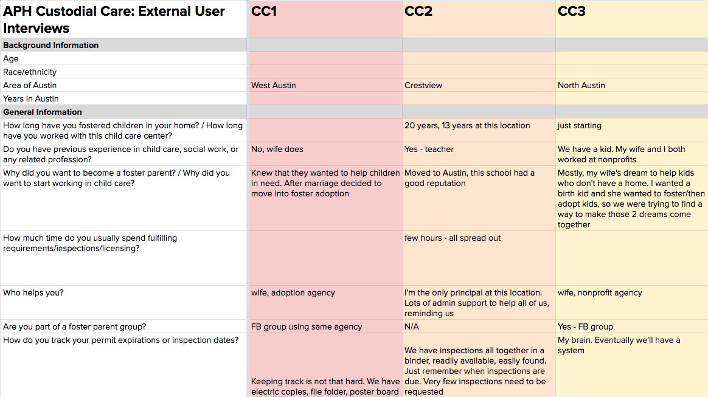

# Anonymity Standards

We are committed to minimizing the risk of harm to residents. In order to do good research we have to collect and document some personal information. Our priority is to be good stewards of the information we collect. We have established the following anonymity practices so that a project cannot link individual responses with participants' identities.

## When we ask for demographic information

There are some circumstances where we ask for a participants' demographic information when doing research. We always take the time to check ourselves by considering why we are asking for demographic data? If there is not good reason to collect it, we don't.

Through our experience we have determined that we ask for demographic detail under two circumstances.

1.  **When the demographics are relevant to a participant's story.**

    Example:
2.  **When there is a issue of equity in the service being offered.**

    Example: When conducting research about Community Gardens we wanted to understand the different needs of senior citizens when they interacted in the physical space of the garden. This required us to collect research participants ages when we interviewed residents.

#### These optional demographics can include:

* Gender
* Ethnicity
* Age
* Income
* Zip code

## Transcribing and documenting research sessions

When we document any type of research (user interview, observation or usability test) we assign each participant a unique number. This is simply a project name abbreviation followed by a number. For example, the first research participant for a project called The Guide would be coded as TG1.

#### Here is an example of how that would look in a rainbow sheet for a usability test:

## Collecting photos and video

Collecting photo and video is an important part of the work we do. Photos taken during user research should be done with the following standards:

* Participants should be asked for consent before _**any**_ photo is taken.
* Photos should not include any part of the participants face and should not reveal and unique identifiers about the participant.
* Photos should be used outside of the project sparingly and with good judgement
