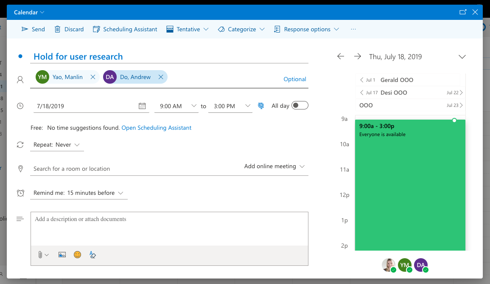
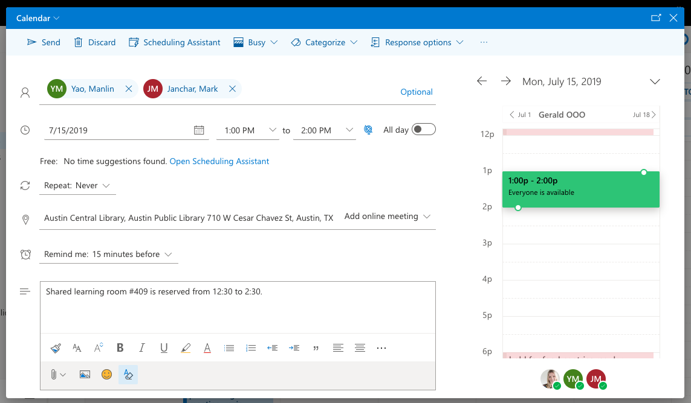

# Scheduling for researchers

#### Step 1

Have a clear understanding of the timeframe and requirements of the research before scheduling research sessions with participants. This is usually documented in a [Recruitment & Screening Document](../recruiting/recruitment-process-and-timeline.md).

#### Step 2

Contact the people who should be at a research sessions to determine availability for research. Make a variety of times available. Some early in the day, some mid-day and some in the afternoon or evening, such as:

* Tuesday, June 12th from 8:00am to 1:00pm
* Wednesday, June 13th from 11:00am to 4:00pm
* Friday, June 15th from 3:00pm to 6:30pm

#### Step 3

Send a calendar placeholder to participants. This prevents them from scheduling meetings or events during the times you are offering.

#### Step 4

Offer those times to all the participants who responded with interest. See how we offer these times to residents by looking at our [Scheduling Research Session](../templates/scheduling-research-session.md) communication template.

#### Step 5

Create a calendar invite for the session when participants accept a research session time. Include the participants name, the location of the session, any notes they might need.

#### Step 6

Clear the holds from the researchers calendars when the research is scheduled.
